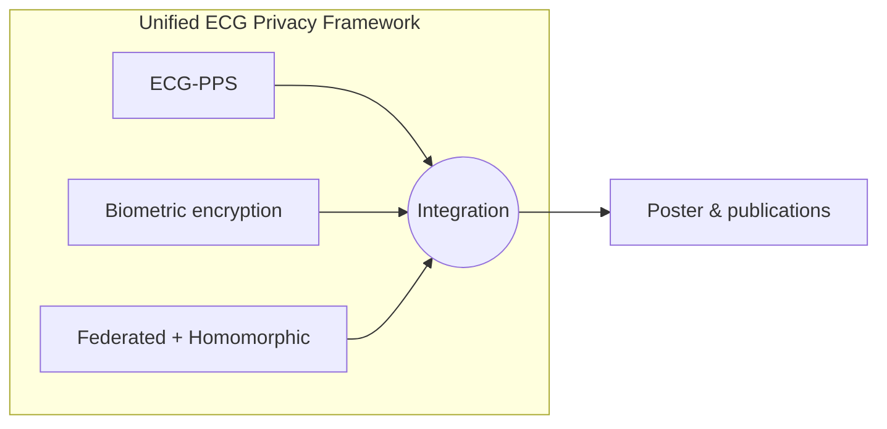

<div align="center">

# 🔐 Unified ECG Privacy Framework

### *Secure Biomedical AI · Privacy-Preserving ECG Systems*

[](https://www.itu.edu.tr/)
[](https://www.python.org/)
[](https://github.com/bbyuksel/ecg-privacy-framework)
[](./phd_poster.pdf)
[](https://orcid.org/0000-0001-5060-6236)

**Beyazıt Bestami YÜKSEL** · PhD · Secure Biomedical AI · Privacy-Preserving Systems  

[Istanbul Technical University](https://www.itu.edu.tr/) · [Istanbul Provincial Directorate of National Education](https://istanbul.meb.gov.tr/)

[](https://github.com/bbyuksel)
[](https://www.linkedin.com/)

</div>

---

## 📌 Overview

This repository is the **research hub** for the **Unified ECG Privacy Framework**: open implementations, cross-links between modules, and a **defense / conference poster** summarizing the research line on secure and intelligent ECG processing—chaotic encryption, fully homomorphic computation, and federated learning—carried out at Istanbul Technical University.

The work is documented in the **peer-reviewed publications** listed below; this repo hosts the **poster** (`phd_poster.pdf`) and ties together the code repositories.

| Asset | Description |
| :--- | :--- |
| 🖼️ [`phd_poster.pdf`](./phd_poster.pdf) | High-level poster (defense / conference) |

---

## 🔗 Framework repositories (cross-links)

Central umbrella: **[`ecg-privacy-framework`](https://github.com/bbyuksel/ecg-privacy-framework)** (this research collection).

| Repository | Role in the framework | Link |
| :--- | :--- | :--- |
| **ECG-PPS** | ECG signal processing pipeline & secure processing foundations | [](https://github.com/bbyuksel/ECG-PPS) |
| **ecg-biometric-encryption** | Biometric-oriented ECG protection & encryption | [](https://github.com/bbyuksel/ecg-biometric-encryption) |
| **federated-learning-ecg-homomorphic-encryption** | Federated learning + homomorphic encryption for ECG | [](https://github.com/bbyuksel/federated-learning-ecg-homomorphic-encryption) |



---

## 📰 Publications & paper links

Use the publisher pages for the authoritative versions. Short list:

| # | Title | Year | Authors (short) |
| :---: | :--- | :---: | :--- |
| 1 | [HEART: A High-Efficiency Adaptive Real-Time Telemonitoring Framework for Secure Electrocardiogram Signal Transmission Using Chaotic Encryption](https://electricajournal.org/index.php/pub/article/view/1329/1305) | 2026 | Yüksel, Yılmazer Metin |
| 2 | [Artificial Intelligence Breakthroughs and Data Futures: A Retrospective and Prospective Review](https://dergipark.org.tr/en/download/article-file/4896110) | 2026 | Yüksel, Yılmazer Metin · *APJESS* 14(1), 1–16 |
| 3 | [Federated learning with homomorphic encryption for secure real time ECG anomaly detection: A multi institutional privacy preserving framework](https://www.sciencedirect.com/science/article/abs/pii/S1746809426001114) | 2026 | Yuksel, Yilmazer Metin · *Biomed. Signal Process. Control* 116, 109557 |
| 4 | [ECG-PPS: Privacy Preserving Disease Diagnosis and Monitoring System for Real-Time ECG Signals](https://ieeexplore.ieee.org/abstract/document/10871599) | 2024 | Yüksel, Yılmazer · Sydney, Australia |

**ORCID:** [https://orcid.org/0000-0001-5060-6236](https://orcid.org/0000-0001-5060-6236)

**Ph.D. dissertation (ITU, February 2026):** *A Unified Framework for Secure and Intelligent ECG Signal Processing via Chaotic Encryption, Fully Homomorphic Computation, and Federated Learning* — full thesis PDF is **not** hosted in this repository; use the `@phdthesis` entry below if you cite the dissertation.

---

## 📚 Citation (BibTeX)

If you use this framework, the poster, associated code, or the dissertation in your research, please cite as appropriate:

```bibtex
@phdthesis{yuksel2026unified,
  author       = {Y{\"u}ksel, Beyaz{\i}t Bestami},
  title        = {A Unified Framework for Secure and Intelligent {ECG} Signal Processing via Chaotic Encryption, Fully Homomorphic Computation, and Federated Learning},
  school       = {Istanbul Technical University},
  year         = {2026},
  month        = feb,
  address      = {Istanbul, T{\"u}rkiye},
  type         = {{Ph.D.} Thesis},
  note         = {Department of Computer Engineering. Advisor: Dr. Ay{\c{s}}e Y{\i}lmazer Metin.}
}

@article{yuksel2026heart,
  author  = {Y{\"u}ksel, Beyaz{\i}t Bestami and Y{\i}lmazer Metin, Ay{\c{s}}e},
  title   = {{HEART}: A High-Efficiency Adaptive Real-Time Telemonitoring Framework for Secure Electrocardiogram Signal Transmission Using Chaotic Encryption},
  year    = {2026},
  url     = {https://electricajournal.org/index.php/pub/article/view/1329/1305}
}

@article{yuksel2026aibreakthroughs,
  author  = {Y{\"u}ksel, Beyaz{\i}t Bestami and Y{\i}lmazer Metin, Ay{\c{s}}e},
  title   = {Artificial Intelligence Breakthroughs and Data Futures: A Retrospective and Prospective Review},
  journal = {Academic Platform Journal of Engineering and Smart Systems},
  volume  = {14},
  number  = {1},
  pages   = {1--16},
  year    = {2026},
  url     = {https://dergipark.org.tr/en/download/article-file/4896110}
}

@article{yuksel2026federatedhe,
  author  = {Yuksel, Beyazit Bestami and Yilmazer Metin, Ayse},
  title   = {Federated learning with homomorphic encryption for secure real time {ECG} anomaly detection: A multi institutional privacy preserving framework},
  journal = {Biomedical Signal Processing and Control},
  volume  = {116},
  pages   = {109557},
  year    = {2026},
  url     = {https://www.sciencedirect.com/science/article/abs/pii/S1746809426001114}
}

@misc{yuksel2024ecgpps,
  author = {Yuksel, BB and Yilmazer, Ayse},
  title  = {{ECG-PPS}: Privacy Preserving Disease Diagnosis and Monitoring System for Real-Time {ECG} Signals},
  year   = {2024},
  note   = {Sydney, Australia},
  url    = {https://ieeexplore.ieee.org/abstract/document/10871599}
}
```

Add official **DOI** fields when you cite the publisher’s DOI pages for cleaner bibliometrics.

---

## 🧭 Quick navigation

- 📊 Poster PDF → [`phd_poster.pdf`](./phd_poster.pdf)  
- 🧩 Code: [ECG-PPS](https://github.com/bbyuksel/ECG-PPS) · [ecg-biometric-encryption](https://github.com/bbyuksel/ecg-biometric-encryption) · [federated-learning-ecg-homomorphic-encryption](https://github.com/bbyuksel/federated-learning-ecg-homomorphic-encryption)  
- 🔗 Umbrella: [ecg-privacy-framework](https://github.com/bbyuksel/ecg-privacy-framework)

---

## 📄 License

Add a `LICENSE` file if you distribute code from this line of work here; poster and text rights may follow your institution’s policy.

---

<div align="center">

**Research Showcase** · *Unified ECG privacy research line (poster + linked codebases)*

[](https://github.com/bbyuksel/ecg-privacy-framework)

</div>
