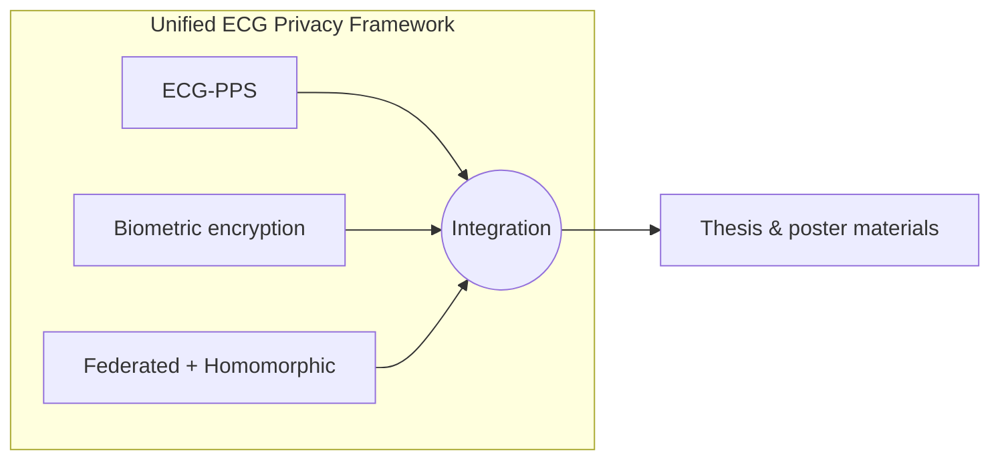

<div align="center">

# 🔐 Unified ECG Privacy Framework

### *Secure Biomedical AI · Privacy-Preserving ECG Systems*

[](https://www.itu.edu.tr/)
[](https://www.python.org/)
[](https://github.com/bbyuksel/ecg-privacy-framework)
[](./phd_poster.pdf)

**Beyazıt Bestami YÜKSEL** · PhD · Secure Biomedical AI · Privacy-Preserving Systems  

[Istanbul Technical University](https://www.itu.edu.tr/) · [Istanbul Provincial Directorate of National Education](https://istanbul.meb.gov.tr/)

[](https://github.com/bbyuksel)
<!-- ORCID rozeti: https://orcid.org/YOUR-ID — örnek: [](https://orcid.org/0000-0000-0000-0000) -->
[](https://www.linkedin.com/)

</div>

---

## 📌 Overview

This repository is the **research hub** for the **Unified ECG Privacy Framework**: implementations and materials supporting the PhD thesis *A Unified Framework for Secure and Intelligent ECG Signal Processing via Chaotic Encryption, Fully Homomorphic Computation, and Federated Learning* (Istanbul Technical University, February 2026).

| Asset | Description |
| :--- | :--- |
| 📄 [`tez_cikti_03032026.pdf`](./tez_cikti_03032026.pdf) | Full PhD thesis (PDF) |
| 🖼️ [`phd_poster.pdf`](./phd_poster.pdf) | Conference / defense poster (PDF) |

---

## 🔗 Framework repositories (cross-links)

Central umbrella: **[`ecg-privacy-framework`](https://github.com/bbyuksel/ecg-privacy-framework)** (this research collection).

| Repository | Role in the framework | Link |
| :--- | :--- | :--- |
| **ECG-PPS** | ECG signal processing pipeline & secure processing foundations | [](https://github.com/bbyuksel/ECG-PPS) |
| **ecg-biometric-encryption** | Biometric-oriented ECG protection & encryption | [](https://github.com/bbyuksel/ecg-biometric-encryption) |
| **federated-learning-ecg-homomorphic-encryption** | Federated learning + homomorphic encryption for ECG | [](https://github.com/bbyuksel/federated-learning-ecg-homomorphic-encryption) |



---

## 📰 Publication & thesis

### Paper / thesis link

| Type | Link / note |
| :--- | :--- |
| **PhD thesis (this repo)** | [Download PDF](./tez_cikti_03032026.pdf) |
| **Peer-reviewed article** | *Yayınlandığında DOI veya yayıncı bağlantısını buraya ekleyin.* |

> **Not:** Kongre bildirisi veya dergi makalesi yayınlandığında aşağıdaki BibTeX girişine `@article{...}` ekleyebilir ve üstteki tabloya DOI rozetini ekleyebilirsiniz.

---

## 📚 Citation (BibTeX)

If you use this framework, thesis, or associated code in your research, please cite:

```bibtex
@phdthesis{yuksel2026unified,
  author       = {Y{\"u}ksel, Beyaz{\i}t Bestami},
  title        = {A Unified Framework for Secure and Intelligent {ECG} Signal Processing via Chaotic Encryption, Fully Homomorphic Computation, and Federated Learning},
  school       = {Istanbul Technical University},
  year         = {2026},
  month        = feb,
  address      = {Istanbul, T{\"u}rkiye},
  type         = {{Ph.D.} Thesis},
  note         = {Department of Computer Engineering. Advisor: Dr. Ay{\c{s}}e Y{\i}lmazer Metin.}
}
```

**APA (7th, örnek)**  
Yüksel, B. B. (2026). *A unified framework for secure and intelligent ECG signal processing via chaotic encryption, fully homomorphic computation, and federated learning* [Doctoral dissertation, Istanbul Technical University].

---

## 🧭 Quick navigation

- 🎓 Thesis PDF → [`tez_cikti_03032026.pdf`](./tez_cikti_03032026.pdf)  
- 📊 Poster PDF → [`phd_poster.pdf`](./phd_poster.pdf)  
- 🧩 Code: [ECG-PPS](https://github.com/bbyuksel/ECG-PPS) · [ecg-biometric-encryption](https://github.com/bbyuksel/ecg-biometric-encryption) · [federated-learning-ecg-homomorphic-encryption](https://github.com/bbyuksel/federated-learning-ecg-homomorphic-encryption)

---

## 📄 License

Specify a license in a `LICENSE` file if you open-source companion code here; thesis text rights usually follow your university’s policy.

---

<div align="center">

**Research Showcase** · *Premium academic README template for the unified ECG privacy research line*

[](https://github.com/bbyuksel/ecg-privacy-framework)

</div>
